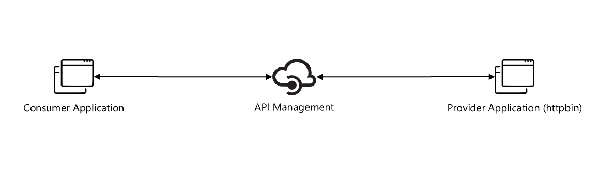

# Azure API Management with Azure OpenAI

Unleash the power of Azure OpenAI to your application developers in a secure & manageable way with Azure API Management and Azure Developer CLI(`azd`).

[](https://codespaces.new/pascalvanderheiden/ais-apim-openai)
[](https://vscode.dev/redirect?url=vscode://ms-vscode-remote.remote-containers/cloneInVolume?url=https://github.com/pascalvanderheiden/ais-apim-openai)

Available as template on:
[](https://aka.ms/awesome-azd)
`azd`

## Build Status

| GitHub Action | Status |
| ----------- | ----------- |
| `azd` Deploy | [](https://github.com/pascalvanderheiden/ais-apim-openai/actions/workflows/azure-dev.yml) |

## About
I've used the Azure Developer CLI Bicep Starter template to create this repository. With `azd` you can create a new repository with a fully functional CI/CD pipeline in minutes. You can find more information about `azd` [here](https://learn.microsoft.com/en-us/azure/developer/azure-developer-cli/).

One of the key points of `azd` templates is that we can implement best practices together with our solution when it comes to security, network isolation, monitoring, etc. Users are free to define their own best practices for their dev teams & organization, so all deployments are followed by the same standards. The best practices I followed for this architecture are: [Azure Integration Service Landingzone Accelerator](https://github.com/Azure/Integration-Services-Landing-Zone-Accelerator/tree/main) and for Azure OpenAI I used the blog post [Azure OpenAI Landing Zone reference architecture](https://techcommunity.microsoft.com/t5/azure-architecture-blog/azure-openai-landing-zone-reference-architecture/ba-p/3882102). 

When it comes to security, there are recommendations mentioned for securing your Azure API Management instance in the Azure Integration Service Landingzone Accelerator. For example, with the use of Front Door or Application Gateway, proving Layer 7 protection and WAF capabilities, and by implementing OAuth authentication on the API Management instance. How to implement OAuth authentication on the API Management instance is described in another repository I've created: [OAuth flow with Azure AD and Azure API Management.](https://github.com/pascalvanderheiden/ais-apim-oauth-flow). Because it really depends on the use case, I didn't implement Front Door or Application Gateway in this repository. But you can easily add it to the Bicep files if you want to, see [this](https://github.com/pascalvanderheiden/ais-sync-pattern-la-std-vnet) repository for as an example.

I'm also using [Azure Monitor Private Link Scope](https://learn.microsoft.com/en-us/azure/azure-monitor/logs/private-link-security#configure-access-to-your-resources). This allows me to define the boundaries of my monitoring network, and only allow traffic from within that network to my Log Analytics workspace. This is a great way to secure your monitoring network.

I've simplified / transformed the output of OpenAI service with a Azure API Management policy using [Liquid](https://learn.microsoft.com/en-us/azure/api-management/set-body-policy#transform-json-using-a-liquid-template). 

The following assets have been provided:

- Infrastructure-as-code (IaC) Bicep files under the `infra` folder that demonstrate how to provision resources and setup resource tagging for azd.
- A [dev container](https://containers.dev) configuration file under the `.devcontainer` directory that installs infrastructure tooling by default. This can be readily used to create cloud-hosted developer environments such as [GitHub Codespaces](https://aka.ms/codespaces).
- Continuous deployment workflows for CI providers such as GitHub Actions under the `.github` directory, and Azure Pipelines under the `.azdo` directory that work for most use-cases.

## Architecture



## Prerequisites

- [Azure Developer CLI](https://docs.microsoft.com/en-us/azure/developer/azure-developer-cli/)

## Next Steps

### Step 1: Initialize a new `azd` environment

```shell
azd init
```

It will prompt you to provide a name that will later be used in the name of the deployed resources.

### Step 2: Provision and deploy all the resources

```shell
azd up
```

It will prompt you to login, pick a subscription, and provide a location (like "eastus"). Then it will provision the resources in your account and deploy the latest code.

For more details on the deployed services, see [additional details](#additional-details) below.

> Note. Because Azure OpenAI isn't available yet in all regions, you might get an error when you deploy the resources. You can find more information about the availability of Azure OpenAI [here](https://docs.microsoft.com/en-us/azure/openai/overview/regions).

> Note. It will take about 45 minutes to deploy Azure API Management.

> Note. Sometimes the dns zones for the private endpoints aren't created correctly / in time. If you get an error when you deploy the resources, you can try to deploy the resources again.

## CI/CD pipeline

This project includes a Github workflow and a Azure DevOps Pipeline for deploying the resources to Azure on every push to main. That workflow requires several Azure-related authentication secrets to be stored as Github action secrets. To set that up, run:

```shell
azd pipeline config
```

## Monitoring

The deployed resources include a Log Analytics workspace with an Application Insights dashboard to measure metrics like server response time.

To open that dashboard, run this command once you've deployed:

```shell
azd monitor --overview
```

## Remove the APIM Soft-delete

If you deleted the deployment via the Azure Portal, and you want to run this deployment again, you might run into the issue that the APIM name is still reserved because of the soft-delete feature. You can remove the soft-delete by using this script:

```ps1
$subscriptionId = "<your-subscription-id>"
$apimName = "<your-apim-name>"
Connect-AzAccount
Set-AzContext -Subscription $subscriptionId
.\del-soft-delete-apim.ps1 -subscriptionId $subscriptionId -apimName $apimName
```

## Testing

I've included a [tests.http](tests.http) file with relevant tests you can perform, to check if your deployment is successful. I've also included a sample test if you implemented OAuth authentication on the API in API Management. You need a subcription key in API Management in order to test the API. You can find more information about how to get a subscription key [here](https://docs.microsoft.com/en-us/azure/api-management/api-management-howto-create-subscriptions#add-a-subscription-key-to-a-user).

## Additional Details

The following section examines different concepts that help tie in application and infrastructure.

### Azure API Management

[Azure API Management](https://azure.microsoft.com/en-us/services/api-management/) is a fully managed service that enables customers to publish, secure, transform, maintain, and monitor APIs. It is a great way to expose your APIs to the outside world in a secure and manageable way.

### Azure OpenAI

[Azure OpenAI](https://azure.microsoft.com/en-us/services/openai/) is a service that provides AI models that are trained on a large amount of data. You can use these models to generate text, images, and more.

### Managed identities

[Managed identities](https://learn.microsoft.com/en-us/azure/active-directory/managed-identities-azure-resources/overview) allows you to secure communication between services. This is done without having the need for you to manage any credentials.

### Virtual Network

[Azure Virtual Network](https://azure.microsoft.com/en-us/services/virtual-network/) allows you to create a private network in Azure. You can use this to secure communication between services.

### Azure Private DNS Zone

[Azure Private DNS Zone](https://docs.microsoft.com/en-us/azure/dns/private-dns-overview) allows you to create a private DNS zone in Azure. You can use this to resolve hostnames in your private network.

### Azure Key Vault

[Azure Key Vault](https://learn.microsoft.com/en-us/azure/key-vault/general/overview) allows you to store secrets securely. Your application can access these secrets securely through the use of managed identities.

### Application Insights

[Application Insights](https://azure.microsoft.com/en-us/services/monitor/) allows you to monitor your application. You can use this to monitor the performance of your application.

### Log Analytics

[Log Analytics](https://azure.microsoft.com/en-us/services/monitor/) allows you to collect and analyze telemetry data from your application. You can use this to monitor the performance of your application.

### Azure Monitor Private Link Scope

[Azure Monitor Private Link Scope](https://learn.microsoft.com/en-us/azure/azure-monitor/logs/private-link-security#configure-access-to-your-resources) allows you to define the boundaries of your monitoring network, and only allow traffic from within that network to your Log Analytics workspace. This is a great way to secure your monitoring network.

### Private Endpoint

[Azure Private Endpoint](https://docs.microsoft.com/en-us/azure/private-link/private-endpoint-overview) allows you to connect privately to a service powered by Azure Private Link. Private Endpoint uses a private IP address from your VNet, effectively bringing the service into your VNet.