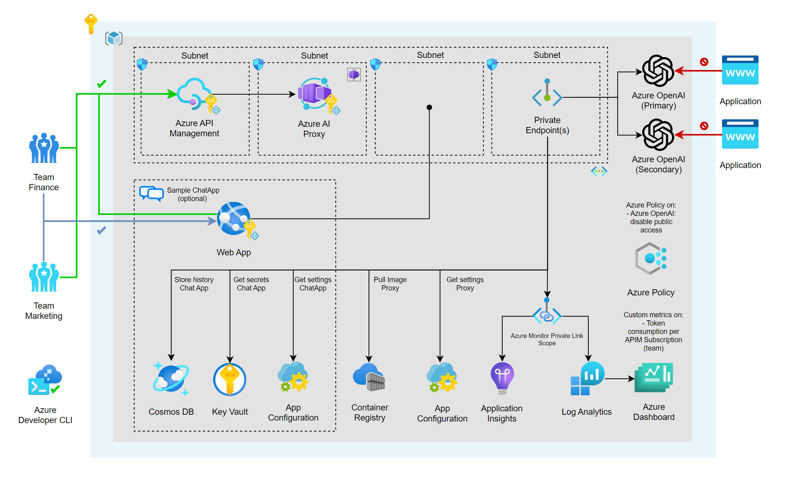

[](https://github.com/codespaces/new?hide_repo_select=true&repo=pascalvanderheiden%2Fais-apim-openai)


## Build Status

| GitHub Action | Status |
| ----------- | ----------- |
| Deploy | [](https://github.com/pascalvanderheiden/ais-apim-openai/actions/workflows/azure-dev.yml) |

## About
Unleash the power of Azure OpenAI to your application developers in a secure & manageable way with Azure API Management.

I've used the Azure Developer CLI Bicep Starter template to create this repository. With AZD you can create a new repository with a fully functional CI/CD pipeline in minutes. You can find more information about AZD [here](https://learn.microsoft.com/en-us/azure/developer/azure-developer-cli/).

The following assets have been provided:

- Infrastructure-as-code (IaC) Bicep files under the `infra` folder that demonstrate how to provision resources and setup resource tagging for azd.
- A [dev container](https://containers.dev) configuration file under the `.devcontainer` directory that installs infrastructure tooling by default. This can be readily used to create cloud-hosted developer environments such as [GitHub Codespaces](https://aka.ms/codespaces).
- Continuous deployment workflows for CI providers such as GitHub Actions under the `.github` directory, and Azure Pipelines under the `.azdo` directory that work for most use-cases.

## Architecture



## Prerequisites

- [Azure Developer CLI](https://docs.microsoft.com/en-us/azure/developer/azure-developer-cli/)

## Next Steps

### Step 1: Initialize a new `azd` environment

```shell
azd init
```

It will prompt you to provide a name that will later be used in the name of the deployed resources.

### Step 2: Provision and deploy all the resources

```shell
azd up
```

It will prompt you to login, pick a subscription, and provide a location (like "westeurope"). Then it will provision the resources in your account and deploy the latest code.

For more details on the deployed services, see [additional details](#additional-details) below.

## CI/CD pipeline

This project includes a Github workflow and a Azure DevOps Pipeline for deploying the resources to Azure on every push to main. That workflow requires several Azure-related authentication secrets to be stored as Github action secrets. To set that up, run:

```shell
azd pipeline config
```

## Monitoring

The deployed resources include a Log Analytics workspace with an Application Insights dashboard to measure metrics like server response time.

To open that dashboard, run this command once you've deployed:

```shell
azd monitor --overview
```

## Remove the APIM Soft-delete

If you deleted the deployment via the Azure Portal, and you want to run this deployment again, you might run into the issue that the APIM name is still reserved because of the soft-delete feature. You can remove the soft-delete by using this script:

```ps1
$subscriptionId = "<your-subscription-id>"
$apimName = "<your-apim-name>"
Connect-AzAccount
Set-AzContext -Subscription $subscriptionId
.\del-soft-delete-apim.ps1 -subscriptionId $subscriptionId -apimName $apimName
```

## Testing

I've included a [tests.http](tests.http) file with relevant tests you can perform, to check if your deployment is successful.

## Additional Details

The following section examines different concepts that help tie in application and infrastructure.

### Azure Front Door

[Azure Front Door](https://azure.microsoft.com/en-us/services/frontdoor/) is a global, scalable entry-point that uses the Microsoft global edge network to create fast, secure, and widely scalable web applications. It offers Layer 7 load balancing and protection against DDoS attacks.

### Azure API Management

[Azure API Management](https://azure.microsoft.com/en-us/services/api-management/) is a fully managed service that enables customers to publish, secure, transform, maintain, and monitor APIs. It is a great way to expose your APIs to the outside world in a secure and manageable way.

### Azure OpenAI

[Azure OpenAI](https://azure.microsoft.com/en-us/services/openai/) is a service that provides AI models that are trained on a large amount of data. You can use these models to generate text, images, and more.

### Managed identities

[Managed identities](https://learn.microsoft.com/en-us/azure/active-directory/managed-identities-azure-resources/overview) allows you to secure communication between services. This is done without having the need for you to manage any credentials.

### Virtual Network

[Azure Virtual Network](https://azure.microsoft.com/en-us/services/virtual-network/) allows you to create a private network in Azure. You can use this to secure communication between services.

### Azure Key Vault

[Azure Key Vault](https://learn.microsoft.com/en-us/azure/key-vault/general/overview) allows you to store secrets securely. Your application can access these secrets securely through the use of managed identities.

### Application Insights

[Application Insights](https://azure.microsoft.com/en-us/services/monitor/) allows you to monitor your application. You can use this to monitor the performance of your application.

### Log Analytics

[Log Analytics](https://azure.microsoft.com/en-us/services/monitor/) allows you to collect and analyze telemetry data from your application. You can use this to monitor the performance of your application.